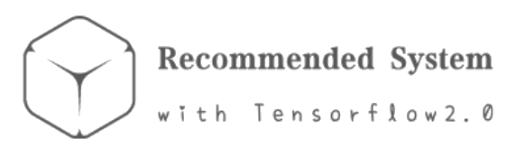
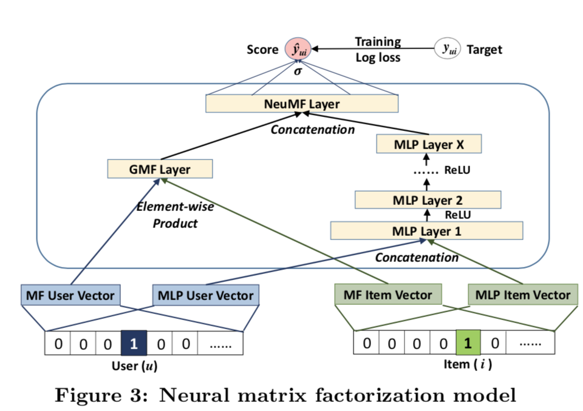
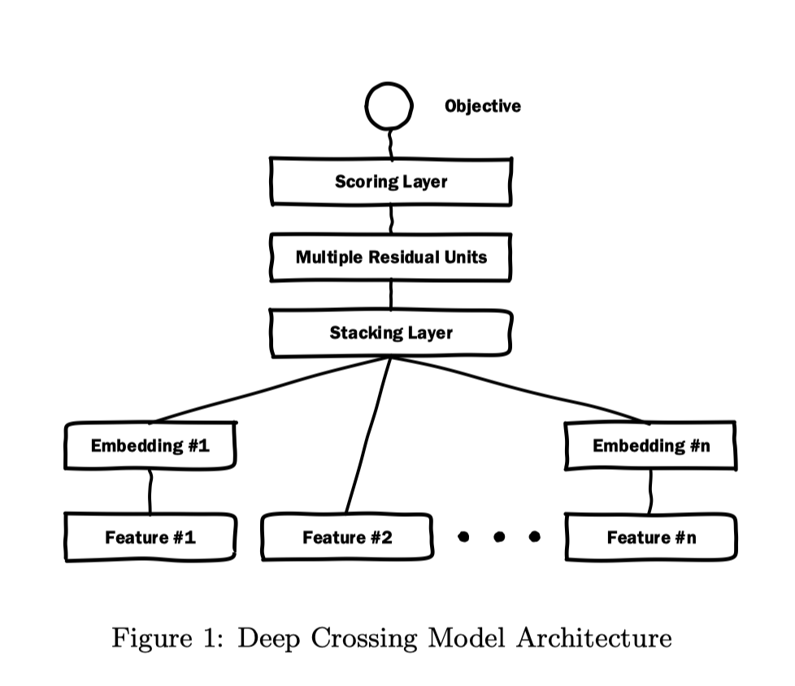

<div>
  
</div>

## 前言

<p align="left">
  
  
  
  
</p>  

本人在读研一，推荐系统方向，和各位一样，在推荐算法这条路愈走愈远，无法自拔。开源项目`Recommended System with TF2.0`主要是对**阅读过的部分推荐系统、CTR预估论文进行复现**。建立的**原因**有三个：

1. 理论和实践似乎有很大的间隔，学术界与工业界的差距更是如此；
2. 更好的理解论文的核心内容，增强自己的工程能力；
3. 很多论文给出的开源代码都是TF1.x，因此想要用更简单的TF2.0进行复现；

当然也看过一些知名的开源项目，如[DeepCTR](https://github.com/shenweichen/DeepCTR)等，不过对自己目前的水平来说，只适合拿来参考。

**项目特点：**

- 使用TF2.0-CPU进行复现；
- 每个模型都是相互独立的，不存在依赖关系；
- 模型基本按照论文进行构建，实验尽量使用论文给出的的公共数据集。如果论文给出github代码，会进行参考；
- 对于[实验数据集](#数据集介绍)有专门详细的介绍；
- 代码源文件参数、函数命名规范，并且带有标准的注释；
- 每个模型会有专门的`.md`文件或者其他方式进行解释；

目前**复现的模型**有（按复现时间进行排序）：

1. [NCF](#1-neural-network-based-collaborative-filteringncf)
2. [DIN](#2-deep-interest-network-for-click-through-rate-predictiondin)
3. [Wide&Deep](#3-wide--deep-learning-for-recommender-systems)
4. [DCN](#4-deep--cross-network-for-ad-click-predictions)
5. [PNN](#5product-based-neural-networks-for-user-response-prediction)
6. [Deep Crossing](#6-deep-crossing-web-scale-modeling-without-manually-crafted-combinatorial-features)


## 更新

2020.07.28：更改ReadMe介绍；

2020.07.27：Deep Crossing模型；

2020.07.20：PNN模型；

2020.07.14：DCN模型；

2020.07.10：Wide&Deep模型；

2020.05.26：DIN模型；

2020.03.27：NCF模型；

## 数据集介绍

目前实验使用的数据集主要有三个：Movielens-1m、Amazon-Electronics、Criteo。

### Movielens

### Amazon-Electronics

### Criteo

Criteo广告数据集是一个经典的用来预测广告点击率的数据集。2014年，由全球知名广告公司Criteo赞助举办[Display Advertising Challenge](https://www.kaggle.com/c/criteo-display-ad-challenge)比赛。但比赛过去太久，Kaggle已不提供数据集。现有三种方式获得数据集或其样本：

1. [Criteo_sample.txt](https://github.com/shenweichen/DeepCTR/blob/master/examples/criteo_sample.txt)：包含在DeepCTR中，用于测试模型是否正确，不过数据量太少；
2. [kaggle Criteo](https://s3-eu-west-1.amazonaws.com/kaggle-display-advertising-challenge-dataset/dac.tar.gz)：训练集（10.38G）、测试集（1.35G）;（实验大部分都是使用该数据集）
3. [Criteo 1TB](https://labs.criteo.com/2013/12/download-terabyte-click-logs/)：可以根据需要下载完整的日志数据集；

Criteo数据集的具体介绍与处理：[传送门](Dataset Introduction.md)


## 复现论文

### 1. Neural network-based Collaborative Filtering（NCF）

**模型：**

<div align=center></div>

**数据集：**

Movielens、Pinterest

**代码：**

- Data：数据集
- Pretrain：预训练保存的模型；
- Save：模型保存；
- configs.py：参数设置，对应模型有对应的参数；
- DataSet.py：构造所需要的数据集，得到负样本集合；
- evaluate.py：评估函数；
- GMF.py：模型；
- MLP.py：模型；
- NeuMF.py：模型；
- utils.py：获得训练样本，加载预训练模型；

**参考原文开源代码地址：**

https://github.com/hexiangnan/neural_collaborative_filtering

**原文地址：**

https://arxiv.org/pdf/1708.05031.pdf?source=post_page---------------------------

**原文笔记：**

  

### 2. Deep Interest Network for Click-Through Rate Prediction(DIN)

**模型：**

<div align=center></div>

**数据集：**

[Amazon](http://jmcauley.ucsd.edu/data/amazon/)数据集中Electronics子集，下载并解压【或手动下载】：

```python
wget -c http://snap.stanford.edu/data/amazon/productGraph/categoryFiles/reviews_Electronics_5.json.gz
gzip -d reviews_Electronics_5.json.gz
wget -c http://snap.stanford.edu/data/amazon/productGraph/categoryFiles/meta_Electronics.json.gz
gzip -d meta_Electronics.json.gz
```

其中`reviews_Electronics_5.json`为用户的行为数据，`meta_Electronics`为广告的元数据。

**代码：**

- datasset：处理过的数据集，dataset.kpl；
- logs：TensorBoard所保存的日志；
- raw_data：原数据存放地址；
- save：模型保存；
- utils：处理数据
  - 1_convert_pd.py
  - 2_remap_id.py
- build_dataset.py：构建数据集；
- dice.py：Dice实现；
- model.py：模型；
- train.py：训练；

**参考原文开源代码地址：**

https://github.com/zhougr1993/DeepInterestNetwork

**原文地址：**

https://arxiv.org/pdf/1706.06978.pdf

**原文笔记：**

https://mp.weixin.qq.com/s/uIs_FpeowSEpP5fkVDq1Nw

  

### 3. Wide & Deep Learning for Recommender Systems

**模型：**

<div align=center></div>


对于Wide&Deep模型来说，Tensorflow中有内置的模型。

**数据集：**

由于原文没有给出公开数据集，所以在此我们使用Amazon Dataset中的Electronics子集，由于数据集的原因，模型可能与原文的有所出入，但整体思想还是不变的。

**代码：**

- logs：TensorBoard保存日志；
- save：模型保存；
- model.py：模型；
- train.py：训练

注：数据集使用了DIN中的构造，所以直接调用了。

**原文地址：**

[https://arxiv.org/pdf/1606.07792.pdf%29/](https://arxiv.org/pdf/1606.07792.pdf)/)

**原文笔记：**

https://mp.weixin.qq.com/s/LRghf8mj1hjUYri_m3AzBg

  

### 4. Deep & Cross Network for Ad Click Predictions

**模型：**

<div align=center></div>

**数据集：**

Criteo Kaggle比赛数据集。

注：由于Kaggle数据已经不公开，且只是为了测试，所以使用了一个小样本数据集【参考了deepctr】，如果想在原数据集上进行实验，可去寻找相关资源。

**代码：**

- dataset：数据集；
- log：TensorBoard保存日志；
- save：模型保存；
- model.py：模型；
- train.py：训练；
- utils.py：数据处理；

**原文地址：**

https://arxiv.org/pdf/1708.05123.pdf

**原文笔记：**

https://mp.weixin.qq.com/s/DkoaMaXhlgQv1NhZHF-7og

  

### 5.Product-based Neural Networks for User Response Prediction

**模型：**

<div align=center></div>

**数据集：**

Criteo Kaggle比赛数据集。

**原文笔记：**

https://mp.weixin.qq.com/s/GMQd5RTmGPuxbokoHZs3eg

<<<<<<< HEAD


### 6. Deep Crossing: Web-Scale Modeling without Manually Crafted Combinatorial Features

**模型：**



**数据集：**

Crieto数据集

**原文地址：**

https://www.kdd.org/kdd2016/papers/files/adf0975-shanA.pdf

**原文笔记：**

https://mp.weixin.qq.com/s/WXnvkoRFxwFpflStAuW7kQ

## 附

公众号：潜心的Python小屋，欢迎大家关注。

<div align=center></div>
[https://github.com/shenweichen/DeepCTR/blob/master/examples/criteo_sample.txt]: 